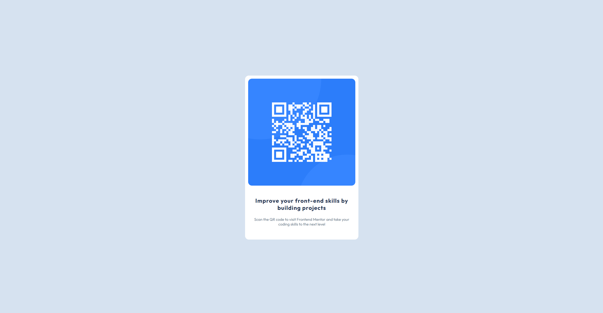

# Frontend Mentor - QR code component solution

Hi, Niels here.
This is a solution to the [QR code component challenge on Frontend Mentor](https://www.frontendmentor.io/challenges/qr-code-component-iux_sIO_H). [Hosted on GH Pages](https://nielsfechtel.github.io/frontendmentor_1_qrcode/).

## Table of contents

- [Frontend Mentor - QR code component solution](#frontend-mentor---qr-code-component-solution)
  - [Table of contents](#table-of-contents)
  - [Overview](#overview)
    - [Screenshot](#screenshot)
    - [What I learned](#what-i-learned)
    - [Continued development](#continued-development)
  - [Author](#author)

## Overview

### Screenshot



### What I learned

Remembered and used Emmet's link:favicon- and link:css-shortcuts.

Some nice nesting for more readable styling, too.

```css
.container {
  background-color: var(--color-white);
  /* ... */

  img {
    width: 100%;
    border-radius: inherit;
  }
}
```

### Continued development

On several mobile devices (at least, using Dev tools), the central card is no longer vertically centered. The viewport is advertised as e.g. being 700px high, as can be seen on the vertical ruler; the body is then that same height, 700px, as it should be with 100dvh; and yet, the element is about 2/3 of the viewport-height. Not sure how that happens. Setting e.g. a small tablet as preset, the vertical centering works again.

It also looked close, but not _quite_ right, so I'll need to continue improving my 'designer-eye' for relative widths, margins, font-sizes etc.

## Author

- Website - [Niels Fechtel](https://niels-fechtel.com)
